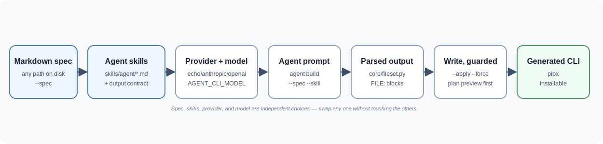

# Spec Agent CLI

[](https://github.com/lilabrooks/spec-agent-cli/actions/workflows/tests.yml)
[](https://github.com/lilabrooks/spec-agent-cli/actions/workflows/code-quality.yml)
[](https://github.com/lilabrooks/spec-agent-cli/actions/workflows/coverage.yml)


A Python 3.12+ starter project for building spec-driven CLI generators. It combines Markdown CLI specs, reusable agent skills, strict Python quality checks, and pluggable model providers without tying the application to one vendor, API, or model family.

<details open>
<summary><strong>📖 Table of Contents</strong></summary>

- [What This Project Provides](#what-this-project-provides)
- [Flow](#flow)
- [Quick Start](#quick-start)
- [Configuration](#configuration)
  - [`AGENT_CLI_PROVIDER`](#agent_cli_provider)
  - [`AGENT_CLI_MODEL`](#agent_cli_model)
    - [How to choose a model](#how-to-choose-a-model)
  - [`AGENT_CLI_SYSTEM_PROMPT`](#agent_cli_system_prompt)
- [Development Setup](#development-setup)
- [Spec Workflow](#spec-workflow)
- [Skill Workflow](#skill-workflow)
- [Building Files from a Spec](#building-files-from-a-spec)
  - [Validating the spec before the model call](#validating-the-spec-before-the-model-call)
- [Step-by-Step: Generate a CLI from Any Spec File and Model](#step-by-step-generate-a-cli-from-any-spec-file-and-model)
  - [Steering the output shape](#steering-the-output-shape)
- [Generated CLI Fixture](#generated-cli-fixture)
- [Project Layout](#project-layout)
- [Provider Design](#provider-design)
- [Naming and Artifacts](#naming-and-artifacts)
- [Quality Standard](#quality-standard)
- [Additional Docs](#additional-docs)
- [Project Status](#project-status)

</details>

## What This Project Provides

You can use this CLI generator to describe a command-line tool as a plain Markdown spec and have an AI agent — on whichever model vendor you choose — turn it into a real, working Python CLI.

- Accepts a spec from anywhere on disk, not just one kept under this repo's own `specs/cli/` folder.
- Works with any model vendor: bundled adapters for Anthropic Claude, OpenAI, and a credential-free `echo` stub, swappable without touching application code.
- Lets you pick a specific model per vendor, independent of which provider is active.
- Applies reusable "skills" that steer how the agent implements, tests, packages, and shapes the UX of what it builds — attach one, several, or all of them.
- Validates a spec's required sections before spending a real model call on it, with a forgiving default and an optional strict mode.
- Shows a full preview of exactly which files a generation would produce before anything is written.
- Writes the generated files for real, refusing to silently overwrite anything already on disk.
- Runs entirely free of API keys and network access out of the box, and only needs credentials once you opt into a real model vendor.
- Ships as a proper, pipx-installable Python package, with its own generated example CLI proving the whole pattern works end to end.

## Flow



## Quick Start

Install the CLI locally with pip:

```bash
python -m pip install .
agent providers
agent run "Write a release note for version 0.1.0"
```

Install it as an isolated command with pipx:

```bash
pipx install .
agent providers
agent run "Write a release note for version 0.1.0"
```

Install directly from GitHub with pipx:

```bash
pipx install "git+https://github.com/lilabrooks/spec-agent-cli.git"
agent providers
my-cli --basic
```

The default specs and skills ship inside the package, so `agent spec` and `agent skill` work from any directory after install. For a complete pipx and artifact guide, see [docs/pipx-artifact-guide.md](docs/pipx-artifact-guide.md).

## Configuration

Three environment variables adjust runtime behavior. They are read directly from the process environment, so set them in your shell before running. There is no `.env` auto-loading.

You can set a variable for a single command by prefixing it, or export it to apply to every command in the shell session:

```bash
# One command only
AGENT_CLI_PROVIDER=echo agent run "Write a release note for version 0.1.0"

# Whole session
export AGENT_CLI_PROVIDER=echo
agent run "Write a release note for version 0.1.0"
```

### `AGENT_CLI_PROVIDER`

Chooses which provider adapter answers the prompt. Default is `echo`. Run `agent providers` to see the adapters that are installed.

Precedence is `--provider` flag, then `AGENT_CLI_PROVIDER`, then the `echo` default. So the flag wins when both are set:

```bash
export AGENT_CLI_PROVIDER=echo
agent run --provider echo "hello"     # --provider wins over the env var
```

An unknown provider fails fast with the list of supported names:

```bash
$ agent run --provider gpt "hello"
Error: Unknown provider 'gpt'. Supported providers: anthropic, echo, openai.
Try 'agent providers' to see available providers.
```

Bundled adapters: `echo` (no credentials or network access), `anthropic` (Claude API, needs `pip install ".[anthropic]"` and an `ANTHROPIC_API_KEY`), and `openai` (Chat Completions API, needs `pip install ".[openai]"` and an `OPENAI_API_KEY`). Add further vendors under `src/agent_cli/providers/` and register them (see [Provider Design](#provider-design)).

**An API key only matters once you've actually selected that provider.** `ANTHROPIC_API_KEY`/`OPENAI_API_KEY` are read by the `anthropic`/`openai` SDKs themselves, not by this CLI, and only the moment `AGENT_CLI_PROVIDER` (or `--provider`) is set to that provider's name — the default `echo` never looks at either variable, so having one exported with `AGENT_CLI_PROVIDER` still unset (or set to `echo`) is a no-op.

It does **not** need to be set globally. Like the other variables in this section, it only has to be present in the process environment for the command that runs — export it in your shell profile if you always want it available, prefix a single command with it if you don't, or set it in a `.env`-loading tool of your own (this project doesn't auto-load one). There's nothing to configure inside the CLI itself; whatever `ANTHROPIC_API_KEY`/`OPENAI_API_KEY` is visible to the process at run time is what the SDK picks up.

### `AGENT_CLI_MODEL`

Overrides which model the active provider adapter calls. There is no CLI flag, so the env var or the adapter's built-in default is used:

```bash
export AGENT_CLI_PROVIDER=anthropic
export AGENT_CLI_MODEL=claude-sonnet-5
agent run "Summarize the changes in version 0.1.0"
```

If unset, each adapter falls back to its own default: `anthropic` → `claude-opus-4-8`, `openai` → `gpt-4o-mini`. The `echo` adapter has no underlying model and ignores this variable entirely.

**`AGENT_CLI_MODEL` alone does nothing.** It only takes effect on whichever provider `AGENT_CLI_PROVIDER`/`--provider` actually selects. Setting `AGENT_CLI_MODEL=claude-sonnet-5` while the provider is still (or defaults to) `echo` is a silent no-op — you'll get the same echoed text either way, with no error to flag the mismatch. Always set both together:

```bash
# Wrong: model is set, but the provider is still the echo default — no effect
export AGENT_CLI_MODEL=claude-sonnet-5
agent run "hello"   # still runs through echo

# Right: provider and model set together
export AGENT_CLI_PROVIDER=anthropic
export AGENT_CLI_MODEL=claude-sonnet-5
agent run "hello"   # now actually calls claude-sonnet-5
```

#### How to choose a model

1. **Pick a provider first.** Model selection only matters once `AGENT_CLI_PROVIDER` is set to `anthropic` or `openai` — pick whichever vendor you have API access to.
2. **Start with the adapter's default and see if it's good enough.** Leaving `AGENT_CLI_MODEL` unset gets you a reasonable starting point (`claude-opus-4-8` for `anthropic`, `gpt-4o-mini` for `openai`) without any extra configuration.
3. **Decide what you're optimizing for** if you want to change it:
   - **Highest quality, cost no object** — `anthropic`: `claude-opus-4-8`. `openai`: `gpt-4o`.
   - **Balanced quality, cost, and speed for everyday tasks** — `anthropic`: `claude-sonnet-5`. `openai`: `gpt-4o-mini`.
   - **Fastest and cheapest, for simple or high-volume tasks** — `anthropic`: `claude-haiku-4-5`. `openai`: `gpt-4o-mini`.
4. **Set `AGENT_CLI_MODEL` to that model's exact ID.** Model IDs are vendor-specific strings (e.g. `claude-sonnet-5`, `gpt-4o`) — check your provider's model documentation for the current list, since vendors add and retire models over time.
5. **Verify it took effect** by running a prompt (`agent run --provider anthropic "hello"`). An invalid or retired model ID surfaces as an error from the vendor's SDK, which confirms the override is being read.

### `AGENT_CLI_SYSTEM_PROMPT`

Sets the system prompt sent to the agent ahead of your task. Default is `You are a concise, practical assistant.`. There is no CLI flag for it, so the env var or the default is used.

```bash
export AGENT_CLI_SYSTEM_PROMPT="You are a terse release-notes writer. Use past tense."
agent run "Summarize the changes in version 0.1.0"
```

Heads-up: the bundled `echo` adapter replies with your task text verbatim and ignores the system prompt, so this variable has no visible effect until you wire up a real model adapter that passes the prompt to the model.

## Development Setup

Built and developed on Python 3.14.6. The project supports 3.12+, and CI runs against 3.12, 3.13, and 3.14. Use any interpreter in that range (`python3.14` shown here):

```bash
python3.14 -m venv .venv
source .venv/bin/activate
python -m pip install -e ".[dev]"
```

Run lint, type-check, and tests on the active interpreter with a single command:

```bash
make check
```

The underlying tools can also be run individually:

```bash
pytest
ruff check .
ruff format --check .
mypy
```

To run the full check across every supported Python version the way CI does, use `make check-all` (needs [uv](https://docs.astral.sh/uv/), which fetches the interpreters on demand). Save it for reproducing a version-specific failure that CI flags.

Run the CLI locally:

```bash
agent providers
agent spec check
agent skill check
```

Heads-up: `pip install -e ".[dev]"` is an **editable** install, so `agent` runs straight from `src/` and never triggers a wheel build. That means the bundled copy of `specs/` and `skills/` under `agent_cli/_bundled/` (see [`resources.py`](src/agent_cli/resources.py)) does not exist yet — `default_spec_root()`/`default_skill_root()` fall back to the checkout's own `specs/cli/` and `skills/agent/`, so spec/skill slugs and `agent build`'s automatic `file-output-contract` attachment only resolve while your current directory is inside this checkout. Run a real (non-editable) install — `pip install .` or `pipx install .` — to get the bundled copy and use `agent` from any directory instead. `--spec`/`--skill` pointed at an explicit file path work either way, since that path is checked before any root lookup.

## Spec Workflow

Write CLI requirements as Markdown specs in `specs/cli/`. Use `specs/templates/cli-spec.md` as the starting point.

Each spec should include:

- `Purpose`
- `Commands`
- `Inputs`
- `Outputs`
- `Behavior`
- `Acceptance tests`

The installed package ships with default specs. A `specs/cli` folder in your current directory takes precedence, so a checkout or your own project can override them.

Validate specs:

```bash
agent spec check
agent spec check my-cli-details
```

Attach a spec to an agent run:

```bash
agent run --spec my-cli-details "Implement this CLI feature"
```

`--spec` is not limited to slugs under `specs/cli/` — it accepts any file path, absolute or relative, so you can point it at a spec you keep anywhere on disk (a scratch file, another project, a path outside this repo entirely):

```bash
agent run --spec /path/to/any/weather-cli.md "Implement this CLI feature"
agent build --spec ./drafts/weather-cli.md --apply "Implement this CLI feature"
```

Resolution tries, in order: the exact path given, that path under the spec root, that path with `.md` appended under the spec root, then a slug match under the spec root. An arbitrary path that exists is used as-is and skips the rest of that lookup.

## Skill Workflow

Agent skills live in `skills/agent/`. They describe how the agent should work while implementing a CLI spec.

Included skills adapted from `multica-ai/andrej-karpathy-skills`:

- `think-before-coding`
- `focused-implementation`
- `goal-driven-execution`

Python and CLI quality skills:

- `python-code-quality`
- `stdlib-cli-ux`
- `cli-test-coverage`
- `python-packaging-cli`
- `file-output-contract` (used automatically by `agent build`; see [Building Files from a Spec](#building-files-from-a-spec))

As with specs, default skills ship inside the package, and a `skills/agent` folder in your current directory takes precedence.

Skills are opt-in by default. Attach selected skills with a spec:

```bash
agent run --spec my-cli-details --skill goal-driven-execution --skill stdlib-cli-ux "Implement this feature"
```

Attach every available skill:

```bash
agent run --spec my-cli-details --all-skills "Implement this feature"
```

## Building Files from a Spec

`agent run` only prints the model's text reply — nothing lands on disk. `agent build` closes that gap: it runs the same spec/skill-aware prompt as `run`, but always attaches an extra `file-output-contract` skill that tells the model to reply with `FILE: <path>` markers followed by a fenced code block per file. `agent build` parses that reply and can write the files it finds.

Without `--apply`, it only prints the plan (which files, and where) so you can review before anything is written:

```bash
agent build --spec my-cli-details "Implement this CLI feature"
```

Add `--apply` to actually write the files, under `--out-dir` (defaults to the current directory):

```bash
agent build --spec my-cli-details --apply --out-dir . "Implement this CLI feature"
```

To keep the write step safe by default, `agent build --apply` refuses to overwrite any file that already exists unless you also pass `--force`:

```bash
$ agent build --apply "Implement this CLI feature"
Error: Refusing to overwrite existing file(s) without --force: src/agent_cli/commands/my_cli.py
```

If the model's reply has no `FILE:` blocks (for example, it just answered a question instead of writing code), `agent build` prints the raw reply and warns on stderr that there was nothing to write — it never fails in that case.

`agent build` accepts the same `--provider`, `--spec`, `--skill`, and `--all-skills` flags as `agent run`.

### Validating the spec before the model call

Since `--spec` accepts any file, including one you just wrote by hand, `agent build` checks it against the same required sections as `agent spec check` before spending a model call on it. By default a spec with errors (missing title, missing a required section) only prints a warning to stderr and the build continues — a spec doesn't have to be perfect to be useful context:

```bash
$ agent build --spec ./drafts/weather-cli.md "Implement this CLI feature"
Warning: spec drafts/weather-cli.md has validation errors:
drafts/weather-cli.md: failed
  Error: missing required section: Acceptance tests
Continuing without --strict. Run 'agent spec check' for the full report.
```

Pass `--strict` to fail fast instead, before any model call is made:

```bash
$ agent build --spec ./drafts/weather-cli.md --strict "Implement this CLI feature"
Error: Spec drafts/weather-cli.md failed validation:
drafts/weather-cli.md: failed
  Error: missing required section: Acceptance tests
Try 'agent spec check drafts/weather-cli.md' to see the full report.
```

## Step-by-Step: Generate a CLI from Any Spec File and Model

This walks through the full path end to end: a spec file that lives anywhere on disk, a specific provider and model, and a generated CLI written to a folder of your choice.

If you're working from an editable dev install (`pip install -e ".[dev]"`), run these commands from inside this checkout — see the note in [Development Setup](#development-setup) on why editable installs need that and a non-editable install doesn't.

1. **Write the spec anywhere on disk.** It does not need to live under this repo's `specs/cli/` — a spec in your home directory, another project, or a scratch folder works the same way. Use [specs/templates/cli-spec.md](specs/templates/cli-spec.md) as the starting shape:

   ```bash
   mkdir -p ~/drafts
   cat > ~/drafts/weather-cli.md <<'EOF'
   ---
   status: draft
   owner: you
   ---
   # weather-cli

   ## Purpose
   A CLI that prints a canned weather report for a city.

   ## Commands
   - `weather-cli today --city <name>`

   ## Inputs
   - `--city`: required city name.

   ## Outputs
   A line of text: `<city>: Sunny, 72F`.

   ## Behavior
   Always print the same canned line for any city.

   ## Acceptance tests
   - Given `--city Boston`, stdout is `Boston: Sunny, 72F`.
   EOF
   ```

2. **Validate the spec before spending a model call on it** (optional, but recommended for a hand-written spec):

   ```bash
   agent spec check ~/drafts/weather-cli.md
   ```

3. **Install a real provider's SDK and set its credentials.** The bundled `echo` provider only echoes text back, so an actual generation step needs `anthropic` or `openai`:

   ```bash
   python -m pip install ".[anthropic]"
   export ANTHROPIC_API_KEY="sk-ant-..."
   ```

4. **Choose the provider and model** with the env vars from [Configuration](#configuration):

   ```bash
   export AGENT_CLI_PROVIDER=anthropic
   export AGENT_CLI_MODEL=claude-sonnet-5
   ```

5. **Preview the plan first**, without writing anything, by pointing `--spec` at the file from step 1:

   ```bash
   agent build --spec ~/drafts/weather-cli.md "Implement the weather-cli command described in this spec"
   ```

   ```text
   Plan: 2 file(s) under .:
     ./weather_cli.py
     ./tests/test_weather_cli.py
   Re-run with --apply to write these files.
   ```

   That exact file list is illustrative, not guaranteed. `agent build` doesn't scaffold any structure of its own — it writes whatever `FILE: <path>` blocks the model's reply contains, wherever the model puts them. A different model, a different task sentence, or different attached skills can just as easily produce one bare script or a full installable package. See [Steering the output shape](#steering-the-output-shape) below to make the shape you want explicit instead of leaving it to the model to guess.

6. **Apply it**, directing the output into a project folder with `--out-dir`:

   ```bash
   agent build --spec ~/drafts/weather-cli.md --apply --out-dir ./weather-cli-project \
     "Implement the weather-cli command described in this spec"
   ```

   ```text
   Wrote weather-cli-project/weather_cli.py
   Wrote weather-cli-project/tests/test_weather_cli.py
   ```

7. **Use the generated CLI** the same way you would any other Python script or package it produced.

Re-running step 6 refuses to overwrite those same files unless you add `--force` — see [Building Files from a Spec](#building-files-from-a-spec) for that safeguard, [Spec Workflow](#spec-workflow) for more on the `--spec` path resolution, and [`AGENT_CLI_MODEL`](#agent_cli_model) for how to pick a model per provider.

### Steering the output shape

`agent build` has no opinion on project shape — a script, a package, one file, ten files, all come from the same `FILE:` contract. The two levers that actually decide the shape are the spec's `Outputs` section (state what you want, don't leave it implicit) and which skills are attached (`python-packaging-cli` in particular nudges the model toward packaging conventions instead of a bare script).

**Loose script (what step 5 assumed):** leaving `Outputs` vague and attaching no skills tends to produce the smallest thing that satisfies `Acceptance tests` — often one script plus one test file, as shown above.

**Installable package:** to reliably get a real package instead, be explicit in both the spec and the task, and attach the packaging skill:

```bash
cat > ~/drafts/weather-cli.md <<'EOF'
---
status: draft
owner: you
---
# weather-cli

## Purpose
A CLI that prints a canned weather report for a city.

## Commands
- `weather-cli today --city <name>`

## Inputs
- `--city`: required city name.

## Outputs
Ship as an installable Python package, not a bare script:
- `pyproject.toml` with a `weather-cli` console-script entry point.
- `src/weather_cli/cli.py` exposing a `main()` function as that entry point.
- `tests/test_cli.py` covering the acceptance tests below.

## Behavior
Always print `<city>: Sunny, 72F` for any city.

## Acceptance tests
- Given `--city Boston`, stdout is `Boston: Sunny, 72F`.
EOF

agent build --spec ~/drafts/weather-cli.md --skill python-packaging-cli --skill stdlib-cli-ux \
  --apply --out-dir ./weather-cli-project \
  "Implement the weather-cli command described in this spec as an installable Python package"
```

```text
Wrote weather-cli-project/pyproject.toml
Wrote weather-cli-project/src/weather_cli/cli.py
Wrote weather-cli-project/tests/test_cli.py
```

Same command, same tool — the difference is entirely in what the spec asked for and which skills primed the model's reply. `--all-skills` is the blunter version of the same idea: attach everything (`python-code-quality`, `cli-test-coverage`, `stdlib-cli-ux`, `python-packaging-cli`, etc.) when you want the fuller quality bar this project itself follows, rather than hand-picking one skill.

## Generated CLI Fixture

The repo includes a small generated CLI fixture named `my-cli`. It prints non-sensitive host machine details and exists as a test case for the generator structure.

```bash
my-cli --basic
my-cli --detailed
```

The fixture spec is [specs/cli/my-cli-details.md](specs/cli/my-cli-details.md). The step-by-step test guide is [docs/my-cli-generator-test.md](docs/my-cli-generator-test.md).

## Project Layout

```text
.
├── src/agent_cli/
│   ├── cli.py              # Main `agent` command surface
│   ├── agents/             # Agent behavior and orchestration
│   ├── commands/           # Generated or fixture CLI command modules
│   ├── config/             # Settings and environment loading
│   ├── core/               # Vendor-neutral contracts, shared types, Markdown parsing, file-output parsing (`fileset.py`)
│   ├── providers/          # Model/provider adapters
│   ├── runtime/            # Composition root for wiring objects together
│   ├── skills/             # Markdown skill loading and validation
│   └── specs/              # Markdown spec loading and validation
├── skills/
│   ├── agent/              # Agent working-style skills
│   └── templates/          # Reusable skill templates
├── specs/
│   ├── cli/                # CLI specs the agent can work from
│   └── templates/          # Reusable spec templates
├── tests/                  # Fast unit tests
├── docs/                   # Architecture, pipx, and fixture guides
└── pyproject.toml          # Packaging, tools, and CLI entry points
```

## Provider Design

The project keeps provider details behind one small protocol:

```python
class LanguageModel(Protocol):
    def complete(self, request: CompletionRequest) -> CompletionResponse:
        ...
```

Agents receive a `LanguageModel` instance instead of constructing provider clients directly. That keeps the CLI, agent logic, tests, and future provider adapters loosely coupled.

To add a real vendor, implement `LanguageModel` under `src/agent_cli/providers/` and register it in `src/agent_cli/providers/registry.py`. The factory, the unknown-provider error, and the `providers` command all read from that registry.

## Naming and Artifacts

This repository has two important names:

- Distribution package: `ai-agent-cli`
- Installed commands: `agent` and `my-cli`

Build artifacts use the distribution package name normalized for Python packaging. That is why `python -m build` creates files like:

```text
ai_agent_cli-0.3.0.tar.gz
ai_agent_cli-0.3.0-py3-none-any.whl
```

That is expected. The installed commands remain:

```bash
agent providers
my-cli --basic
```

## Quality Standard

Use pytest for behavior tests. Prefer function-level tests with fixtures such as `tmp_path`, `capsys`, and `monkeypatch`.

Ruff handles linting and formatting, and mypy runs in strict mode. Run them together with `make check`, or individually as shown in [Development Setup](#development-setup).

Runtime code should stay dependency-free unless a spec requires a dependency. Development-only tools belong in the `dev` optional dependency group.

## Additional Docs

- [CHANGELOG.md](CHANGELOG.md)
- [docs/architecture.md](docs/architecture.md)
- [docs/pipx-artifact-guide.md](docs/pipx-artifact-guide.md)
- [docs/my-cli-generator-test.md](docs/my-cli-generator-test.md)
- [docs/skill-research.md](docs/skill-research.md)
- [skills/README.md](skills/README.md)
- [specs/README.md](specs/README.md)

## Project Status

This is a personal side project, maintained on a best-effort basis rather than a supported product. Tests, linting, and type-checking run on every change, but there's no SLA on response time — issues and pull requests are welcome, and may take a while to get to.
